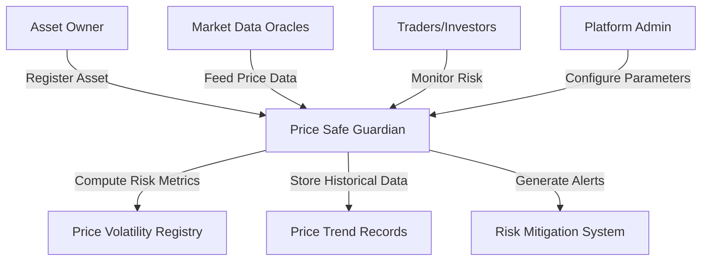

# Price Safe Guardian

A decentralized platform for dynamic price monitoring, risk assessment, and stabilization of digital assets on the Stacks blockchain.

## Overview

Price Safe Guardian provides a comprehensive framework for:
- Tracking real-time price volatility
- Implementing adaptive risk management
- Setting dynamic price guardrails
- Monitoring asset risk metrics
- Triggering automated risk mitigation strategies

The platform helps investors and traders maintain price stability and minimize potential financial risks.

## Architecture



### Core Components
- **Price Volatility Tracker**: Monitors real-time price fluctuations
- **Risk Assessment Engine**: Computes and evaluates asset risk
- **Guardrail Mechanism**: Sets dynamic price boundaries
- **Mitigation Strategy System**: Triggers risk reduction actions
- **Historical Data Repository**: Maintains comprehensive price history

## Contract Documentation

### price-safe-guardian.clar

The main contract managing price stability and risk monitoring.

#### Key Features
- Dynamic price monitoring
- Risk metric computation
- Adaptive guardrail configuration
- Automated risk mitigation
- Comprehensive data tracking

#### Access Control
- Platform Admin: System configuration
- Asset Owners: Asset registration
- Public: Risk information query
- Oracles: Price data updates

## Getting Started

### Prerequisites
- Clarinet
- Stacks wallet
- Access to price data oracles
- Digital asset tracking infrastructure

### Basic Usage

1. **Register Asset for Monitoring**
```clarity
(contract-call? 
  .price-safe-guardian 
  register-asset 
  asset-principal 
  "BTC-USD" 
  "Cryptocurrency Pair" 
  u10000)  ;; Initial price threshold
```

2. **Check Asset Risk**
```clarity
(contract-call? 
  .price-safe-guardian 
  get-asset-risk-metrics 
  asset-principal)
```

## Function Reference

### Public Functions

#### Asset Management
```clarity
(register-asset asset-id name description initial-threshold)
(update-risk-parameters asset-id max-volatility liquidation-threshold)
(pause-monitoring asset-id)
```

#### Risk Monitoring
```clarity
(update-price-data asset-id current-price block-timestamp)
(compute-risk-score asset-id)
(trigger-risk-mitigation asset-id)
```

#### Information Retrieval
```clarity
(get-asset-risk-metrics asset-id)
(get-historical-price-data asset-id start-block end-block)
```

## Development

### Testing
1. Set up local Clarinet environment
```bash
clarinet new
```

2. Deploy contracts
```bash
clarinet console
```

3. Run test scenarios
```clarity
;; Test asset registration
(contract-call? .price-safe-guardian register-asset 
  'ST1PQHQKV0RJXZFY1DGX8MNSNYVE3VGZJSRTPGZGM 
  "ETH-USD" 
  "Ethereum USD Pair" 
  u5000)
```

### Local Setup
1. Clone repository
2. Install dependencies
3. Configure price data sources
4. Deploy smart contracts

## Risk Management Considerations

### Best Practices
- Continuously monitor asset price volatility
- Set appropriate risk thresholds
- Implement multi-layered risk mitigation
- Utilize historical price trend analysis
- Regularly update risk parameters

### Limitations
- Real-time data dependency
- External oracle reliability
- Market unpredictability
- Potential delayed risk responses

### Risk Mitigation Strategies
- Implement dynamic guardrails
- Use probabilistic risk scoring
- Enable automated circuit breakers
- Maintain diverse asset monitoring
- Provide transparent risk metrics